# Análise de Dados do Cinema com Python

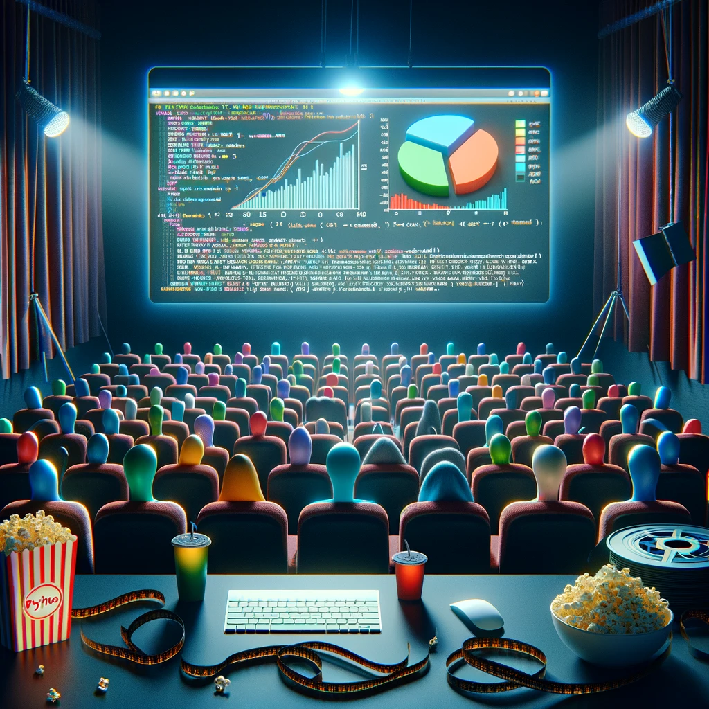

## Contexto do Negócio 💼

A indústria cinematográfica é uma das mais vibrantes e influentes globalmente, afetando não apenas a economia, mas também a cultura e a sociedade. Com milhares de filmes lançados a cada ano, profissionais da indústria, pesquisadores e entusiastas do cinema buscam constantemente entender as tendências, preferências do público e fatores que contribuem para o sucesso de um filme.

## Objetivo 🎯

O objetivo principal deste projeto é coletar, tratar e analisar dados sobre filmes de diversas épocas e gêneros para gerar insights que possam ser úteis para profissionais da indústria, pesquisadores ou entusiastas do cinema.

## Tópicos📌

- [Visão Geral🌐](#visão-geral)
- [Ferramentas e Tecnologias Utilizadas🛠️](#ferramentas-e-tecnologias-utilizadas%EF%B8%8F)
- [Coleta de Dados📊](#coleta-de-dados)
- [Limpeza e Pré-Processamento de Dados🧹](#limpeza-e-pré-processamento-de-dados)
- [Conjunto de Dados📚](#conjunto-de-dados)
- [Análise Exploratória de Dados (EDA) e Visualizações🔍](#análise-exploratória-de-dados-eda-e-visualizações)
- [Conclusões e Recomendações💡](#conclusões-e-recomendações)
- [Considerações Finais📝](#considerações-finais)
- [Licença©️](#licença%EF%B8%8F)
- [Créditos👏](#créditos)
- [Disclaimer⚠️](#disclaimer%EF%B8%8F)

## Visão Geral🌐
Ao longo desse README, estão somente as análises e explicações mais importantes. Os códigos e procedimentos estão mais detalhados no Jupyter Notebook, assim como análises adicionais menos importantes, ou seja, que não geraram insights significativos. O notebook pode ser encontrado neste repositório.

### Etapa 1: Coleta de dados:
Gerar funções que interajam com a API OMDb para coletar de forma automatizada um conjunto de dados abrangente de filmes.

### Etapa 2: Limpeza e pré-processamento dos dados:
Empregar métodos de limpeza de dados e pré-processamento para garantir que o conjunto de dados esteja em um estado ideal para análise. Isso inclui tratamento de valores ausentes e transformações dos dados, assim como a identificação e remoção de outliers.

### Etapa 3: Análise exploratória de dados (EDA) e visualizações:
Implementar uma análise exploratória abrangente, utilizando estatísticas descritivas e técnicas de análise de dados para identificar padrões, tendências e possíveis correlações nos dados. Partindo de análises unidimensionais até bidimensionais. Assim como, criar uma série de visualizações de dados impactantes e informativas que complementem e aprimorem os insights gerados durante a fase de análise exploratória.

### Etapa 4: Conclusões:
Com base na análise exploratória de dados e nas visualizações, sintetizar os principais insights e descobertas obtidos a partir do conjunto de dados e sugerir áreas de pesquisa e análise futuras que podem ser exploradas para aprofundar o entendimento sobre o tema e gerar novos insights.

## Ferramentas e Tecnologias Utilizadas🛠️

- **Python**: Linguagem de programação principal do projeto.
- **Pandas**: Biblioteca do Python para manipulação e análise de dados.
- **Requests**: Ferramenta utilizada para realizar requisições HTTP à API OMDb durante o processo de coleta de dados.
- **Matplotlib e Seaborn**: Bibliotecas do Python para visualização de dados.

## Coleta de Dados📊

- A coleta de dados foi realizada em duas etapas: inicialmente, coletamos os ID's dos filmes que queremos obter os dados. Estes IDs são então utilizados como parâmetros para solicitações à API OMDb, a fim de obter o conjunto de dados.
  
- A seleção de filmes para esta análise foi restrita àqueles que receberam um mínimo de 150 avaliações de usuários. Este critério foi estabelecido para garantir que as notas dos filmes sejam confiáveis e representativas da percepção geral do público sobre um determinado filme.

- O limite de 150 avaliações serve como um ponto de equilíbrio: é alto o suficiente para conferir credibilidade às notas, mas baixo o suficiente para evitar a introdução de um viés de popularidade. Isso permite que filmes menos conhecidos, mas ainda bem avaliados, sejam inclusos na análise, oferecendo um panorama mais abrangente do cenário cinematográfico.

- Foram definidas funções específicas para a coleta. A amostra bruta de dados ficou com um total de 94.785 filmes.

## Limpeza e Pré-Processamento de Dados🧹

Nessa etapa foi utilizado principalmente o Pandas para limpeza e transformação dos dados. As principais ações realizadas foram:
- Verificação e remoção de dados faltantes: Valores nulos e inclusive dados N/A em forma de string;
- Verificação e remoção de duplicatas;
- Verificação e conversão dos tipos dos dados;
- Transformação da coluna gêneros: Essa coluna estava preenchida como uma lista, podendo variar até 3 gêneros em cada linha do dataset. Foi aplicada uma transformação para separar essa coluna em 3 colunas distintas (gênero primário, secundário e terciário).
- Detecção de Outliers: Foi utilizado o método interquartil (IQR) para detectar os outliers das colunas `imdb_rating` e `duracao` e os resultados foram 1526 outliers para a coluna `imdb_rating` e 5753 para a coluna `duracao`. Os outliers foram então filtrados do dataset, visto que eles podem distorcer os resultados e afetar a qualidade das análises estatísticas. Para manter a integridade do estudo, os dados dos outliers foram salvos em um arquivo separado. Isso permitirá uma análise mais aprofundada no futuro, caso seja necessário.

## Conjunto de Dados📚

O conjunto de dados após a limpeza e transformações ficou da seguinte forma:

| Coluna             | Tipo     | Descrição                                       |
|--------------------|----------|-------------------------------------------------|
| `titulo`           | `object` | Título do filme                                 |
| `ano`              | `int64`  | Ano que o filme foi lançado                     |
| `imdb_rating`      | `float64`| Classificação do IMDb (nota dada pelos usuários)|
| `imdb_votes`       | `int64`  | Número de votos dados pelos usuários do site    |
| `duracao`          | `float64`| Duração do filme em minutos                     |
| `diretor`          | `object` | Diretor responsável pelo filme                  |
| `genero_primario`  | `object` | Gênero principal do filme                       |
| `genero_secundario`| `object` | Subgênero secundário do filme                   |
| `genero_terciario` | `object` | Subgênero terciário do filme                    |

Após inspeções qualitativas, foi possível constatar que os gêneros estavam em ordem de importância no conjunto de dados, sendo o primeiro gênero da lista aquele que é mais predominante no filme, essa é a razão pela qual essa separação foi adotada.

## Análise Exploratória de Dados (EDA) e Visualizações🔍

A análise exploratória foi divida em três etapas:
1. Obtenção das estatísticas descritivas básicas
2. Análises unidimensionais
3. Análises bidimensionais
Foram utilizadas em conjunto as bibliotecas Pandas, Matplotlib e Seaborn.

### Estatísticas descritivas básicas:

**Ano (`ano`)**
- A base de dados contém filmes lançados entre 1906 e 2023.
- A média de lançamento dos filmes é aproximadamente 1996, o que sugere que a coleção é bastante diversificada em termos de época.
    
**Classificação do IMDb (`imdb_rating`)**
- A média da classificação é de aproximadamente 5.87, com um desvio padrão de 1.15, indicando uma variação moderada nas classificações.
- As classificações variam de 2.7 a 9.1, conforme os limites definidos durante a remoção de outliers.

**Número de Votos no IMDb (`imdb_votes`)**
- O número médio de votos por filme é de aproximadamente 10,344.
- O número de votos varia significativamente, com um desvio padrão elevado de 53,072.
  
**Duração (`duracao`)**
- A duração média dos filmes é de aproximadamente 98 minutos.
- A duração varia de 57 a 140 minutos, com um desvio padrão de aproximadamente 15.5 minutos.

**Gênero Primário (`genero_primario`)**
- O conjunto de dados contém 21 gêneros primários únicos.
- "Drama" é o gênero mais comum, aparecendo 25,311 vezes.

**Gênero Secundário (`genero_secundario`)**
- Existem 24 gêneros secundários únicos.
- "Drama" também é o gênero secundário mais comum.

**Gênero Terciário (`genero_terciario`)**
- Existem 21 gêneros terciários únicos.
- "Thriller" é o gênero terciário mais comum.

**Diretor (`diretor`)**
- Há 35,940 diretores únicos no conjunto de dados.
- Jesús Franco é o diretor mais frequentemente listado, com 92 filmes.
    
### Análises Unidimensionais:

**Distribuição do Ano de Lançamento**:
- A maioria dos filmes no conjunto de dados foi lançada após o ano 2000.
- Há uma tendência crescente de filmes após esse ano. Isso pode sugerir que o avanço tecnológico facilitou a produção de filmes, resultando em um aumento no número de lançamentos.
- A diminuição recente se deve em relação à pandemia do COVID-19, que resultou em uma paralisação nas  produções.

**Distribuição da Classificação IMDb**:
- A distribuição das classificações do IMDb é aproximadamente normal.
- A maior parte dos filmes tem classificações entre 5 e 7.
- A distribuição é levemente inclinada para a esquerda, o que indica que filmes com classificações extremamente altas são mais raros do que aqueles com classificações baixas.

**Distribuição do Número de Votos no IMDb**:
- A coleta foi filtrada para incluir apenas filmes com pelo menos 150 votos.
- O uso da escala logarítmica no eixo \(x\) revela que a maioria dos filmes tem relativamente poucos votos.
- Isso sugere que a quantidade de votos não é necessariamente um indicativo de representatividade ou qualidade do filme.

**Distribuição da Duração do Filme**:
- A duração dos filmes segue uma distribuição normal, centrada em torno de 95 a 100 minutos.
- A maioria dos filmes tem uma duração que varia de 80 a 120 minutos.
- Isso sugere que a "duração padrão" para a maioria dos filmes é de aproximadamente 1,5 a 2 horas.

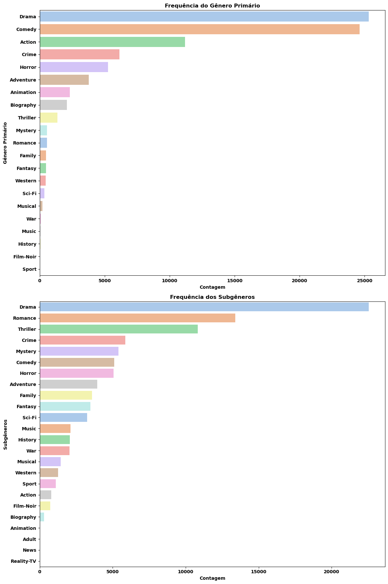

- O **Drama** é um gênero extremamente popular, tanto como gênero principal quanto como subgênero. Isso pode indicar que muitos filmes buscam contar histórias profundas e envolventes que ressoam emocionalmente com o público.
- A presença significativa de **Romance** e **Thriller** como subgêneros sugere que muitos filmes, independentemente de seu gênero principal, incorporam elementos românticos e/ou de suspense, possivelmente para ampliar seu apelo ao público. É interessante ressaltar que estes gêneros são pouco usados como gênero principal, o que sugere que eles não são suficientes para sustentar uma trama por si só.
- A diversidade de gêneros e subgêneros reflete a riqueza e variedade do cinema. Filmes frequentemente mesclam diferentes gêneros para criar narrativas complexas e multidimensionais.

### Análises Bidimensionais:

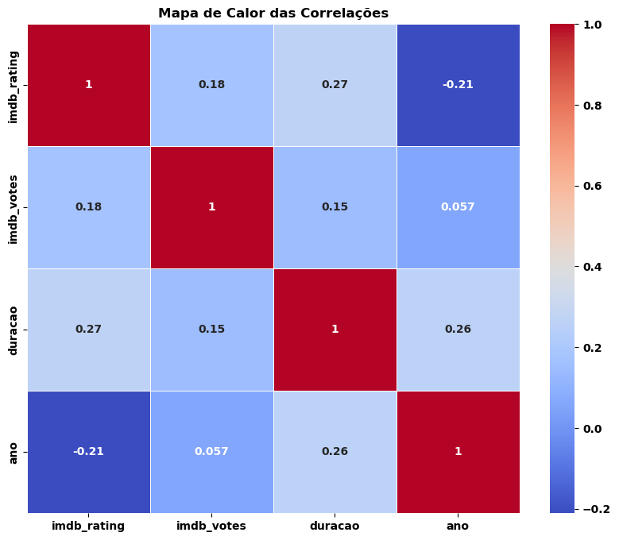

- Os filmes que possuem uma quantidade maior de votos no IMDb tendem a ter classificações ligeiramente mais altas, o que pode indicar uma combinação de popularidade e qualidade.
- Há uma tendência leve, mas notável, de filmes mais longos receberem classificações mais altas. Isso pode refletir uma preferência por tramas mais detalhadas ou desenvolvidas.
- Filmes mais recentes têm uma ligeira tendência de receber classificações mais baixas. Pode ser interessante investigar se isso é um reflexo de mudanças nas expectativas do público ou outras dinâmicas da indústria cinematográfica.
- O aumento gradual na duração dos filmes ao longo do tempo pode ser reflexo de mudanças nas convenções cinematográficas, tecnologias de produção ou preferências do público.

Essas observações, embora baseadas em correlações fraca a moderada, fornecem insights úteis sobre as tendências e relações nos dados. No entanto, é importante lembrar que correlação não implica causalidade, e uma análise mais aprofundada seria necessária para fazer afirmações definitivas.

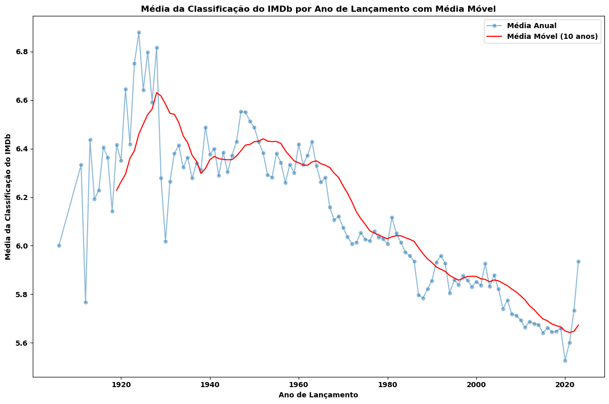

**Era de Ouro do Cinema**: Filmes lançados antes de 1960 tendem a ter uma média de classificação mais alta. Isso pode refletir o "efeito de nostalgia", onde filmes mais antigos são vistos como clássicos e, consequentemente, recebem classificações mais altas. Outra possibilidade é que somente os melhores filmes daquela época tenham perdurado e sejam mais amplamente reconhecidos, enquanto filmes menos memoráveis tenham sido esquecidos.

**Decadência após os anos 1960**: Há um declínio perceptível nas médias das classificações a partir dos anos 1960. A democratização do cinema e da crítica pode ter ampliado a diversidade de avaliações, resultando em médias mais baixas. Além disso, o aumento na quantidade de filmes produzidos pode ter contribuído para essa queda, com uma diluição da qualidade média.

**Ressurgimento Recente**: A média das classificações mostra uma ligeira recuperação nos anos mais recentes (2021-2023). Isso pode ser o resultado de uma mudança nas avaliações ou uma melhoria na qualidade dos filmes. A pandemia de COVID-19 também pode ter desempenhado um papel, influenciando tanto a produção quanto a percepção dos filmes durante esse período.

**Flutuações em Filmes Anteriores a 1960**: Filmes anteriores a 1960 apresentam flutuações notáveis nas médias anuais. Devido ao menor número de filmes desses anos presentes no conjunto de dados, as médias são mais sensíveis a avaliações extremas, resultando em variações mais pronunciadas.

Estes insights proporcionam uma visão abrangente das tendências nas avaliações de filmes ao longo dos anos, destacando períodos de destaque e mudanças notáveis na percepção do público.

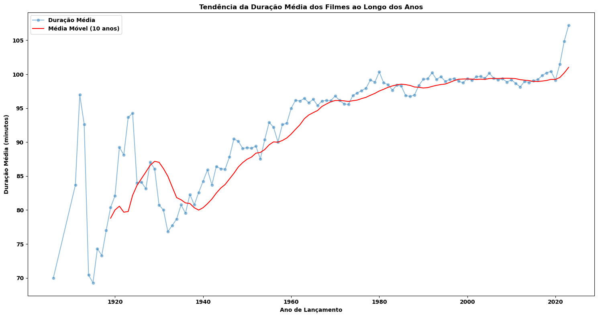

**Era dos Filmes Curtos**: Nos primórdios do cinema, especialmente em torno de 1920, os filmes eram consideravelmente mais curtos, com uma média de duração de cerca de 52 minutos. Isso provavelmente reflete as limitações tecnológicas e de produção da época, restringindo a extensão dos filmes.

**Ascensão da Narrativa Cinematográfica**: Há um aumento progressivo na duração dos filmes do final dos anos 1920 até meados dos anos 1970, atingindo uma média de 100 minutos. Este fenômeno pode ser o resultado do amadurecimento da indústria cinematográfica, com tramas mais complexas e produções mais ambiciosas exigindo mais tempo de tela.

**Norma da Indústria**: Após o aumento sustentado, a duração média dos filmes estabiliza-se, oscilando levemente em torno de 100 minutos por várias décadas até os anos 2020. Isso indica a consolidação de uma norma industrial quanto ao tempo de duração "ideal" de um filme, equilibrando a necessidade de desenvolvimento narrativo com as preferências do público.

**Era de Experiências Cinematográficas Expansivas**: A partir de 2021, nota-se um aumento na duração média dos filmes, sugerindo uma mudança nas preferências tanto dos criadores quanto dos espectadores. Inicialmente impulsionado pelo contexto da pandemia, que pode ter favorecido conteúdos mais longos para públicos confinados, este aumento na duração dos filmes parece se sustentar além desse período. Isso pode refletir um interesse crescente em experiências cinematográficas mais imersivas e detalhadas.

**A "Duração Ideal"**: Em média, ao longo dos anos, os filmes tendem a durar cerca de 102 minutos. Esta "duração ideal" ressoa com a expectativa do público e se adapta a uma ampla variedade de gêneros e narrativas, demonstrando que, independentemente das tendências temporais, existe uma preferência consistente que molda a produção cinematográfica.

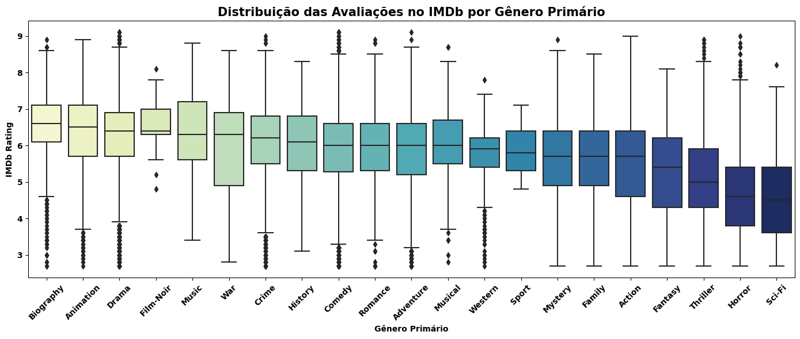

**Gêneros Mais Altamente Avaliados**:
- **Biografia**: Com uma mediana de 6.6, o gênero biografia se destaca como o mais bem avaliado, refletindo a apreciação do público por histórias baseadas em eventos e personalidades reais.
- **Animação**: Com uma mediana de 6.5, este gênero demonstra uma forte preferência, especialmente considerando que animações muitas vezes atraem públicos de todas as idades.
- **Drama**: Consistindo no maior número de filmes, o gênero drama tem uma mediana de 6.4, o que é um testemunho de sua popularidade e aceitação ampla pelo público.

**Gêneros Menos Favorecidos**:
- **Terror**: Apesar de ser um gênero popular com um grande número de filmes, o terror tem uma mediana de 4.6, indicando que o público deste gênero é bastante quanto à qualidade do filme.
- **Sci-Fi**: Com uma mediana de 4.5, o gênero de ficção científica, embora possa ter um seguimento cult, tem uma média de classificação relativamente baixa.
  
**Intervalo de Variações Dentro dos Gêneros**:
A variação dentro dos gêneros, como indicado pelos quartis, mostra que enquanto alguns gêneros têm avaliações consistentemente altas ou baixas, outros, como **Guerra** e **Ação**, têm uma ampla gama de avaliações, como indicado pelo tamanho do box plot. Isso indica que a qualidade dos filmes desses gêneros são mais suscetíveis a serem influenciadas por outros fatores do que, por exemplo, o gênero **Biografia** que, apesar de ter avaliações diversificadas, tem notas consistentemente mais altas e dentro de um intervalo menor.

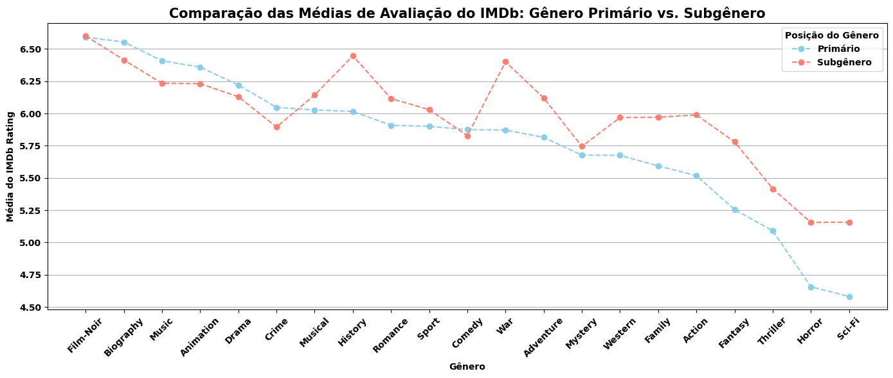

Nota: Nesta análise, os gêneros secundário e terciário foram tratados como subgênero, a fim de facilitar a comparação entre os gêneros primários e por não haver uma diferença significativa entre um gênero secundário e terciário em um filme, sendo eles tratados como complementares

**Realce através do Subgênero**: De modo geral, um gênero frequentemente obtém avaliações mais altas quando é integrado como subgênero. Isso sugere que a introdução de determinados temas ou estilos cinematográficos como elementos complementares pode realçar a narrativa principal, tornando-a mais envolvente para o público.

**O Poder da Combinação**: Gêneros como **História**, **Guerra**, **Ação** e **Aventura** exemplificam essa tendência. Quando posicionados como gêneros principais, podem não ter o mesmo impacto no público. No entanto, ao serem introduzidos como subgêneros, enriquecendo a narrativa principal de outro gênero, a reação do público tende a ser mais favorável.

**Exceções Notáveis**: Contudo, há gêneros que desafiam essa tendência geral. **Musical**, **Drama** e **Crime**, por exemplo, tendem a ser mais bem avaliados quando são o gênero principal do filme. Isso destaca sua força intrínseca e a capacidade de se manterem como pilares narrativos centrais, sem a necessidade de serem complementados por outros gêneros.

**A Arte da Narrativa Cinematográfica**: Esses padrões sublinham a versatilidade e a complexidade da narrativa cinematográfica. A habilidade de mesclar e harmonizar gêneros pode criar experiências mais imersivas, enquanto certos gêneros retêm sua força e apelo, independentemente de sua posição na estrutura da história.

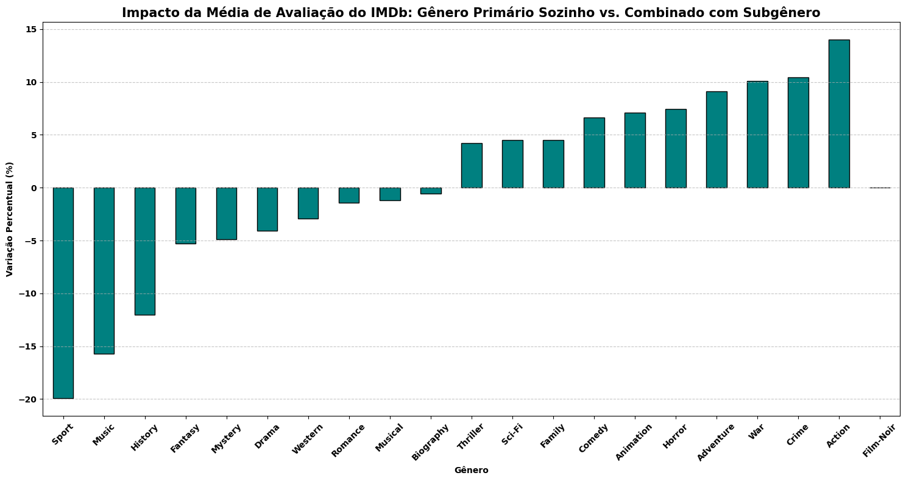

**Interpretação de Gêneros Tradicionalmente "Puros"**: Gêneros como "Esporte", "Music" e "História" têm uma queda significativa em suas avaliações quando combinados com outros subgêneros. Isso pode sugerir que o público prefere uma abordagem mais "pura" ou tradicional para esses tipos de filmes. Por exemplo, os espectadores podem preferir filmes esportivos que se concentram estritamente em esportes, sem a introdução de elementos de outros gêneros.

**Versatilidade de Gêneros Populares**: Gêneros como "Ação", "Crime" e "Guerra" experimentam um aumento nas avaliações quando combinados com outros gêneros. Isso indica que a inclusão de elementos de outros gêneros pode enriquecer a narrativa ou tornar o filme mais dinâmico e interessante para o público. Por exemplo, um filme de ação com elementos de mistério ou romance pode ser mais envolvente do que um filme de ação puro.

**Neutralidade de Certos Gêneros**: Gêneros como "Biografia", "Romance" e "Musical" mostram variações mínimas, sugerindo que a combinação com outros subgêneros não tem um impacto significativo nas avaliações. Isso pode indicar que a essência desses gêneros permanece intacta, independentemente da introdução de elementos de outros gêneros.

**Implicações para Produtores e Diretores**: Ao decidir o gênero e a narrativa de um filme, os cineastas podem considerar essas tendências. Se estiverem produzindo um filme esportivo, por exemplo, pode ser benéfico manter-se fiel ao gênero. Por outro lado, se estiverem se aventurando em um filme de ação, a introdução de subgêneros pode ser uma boa estratégia.

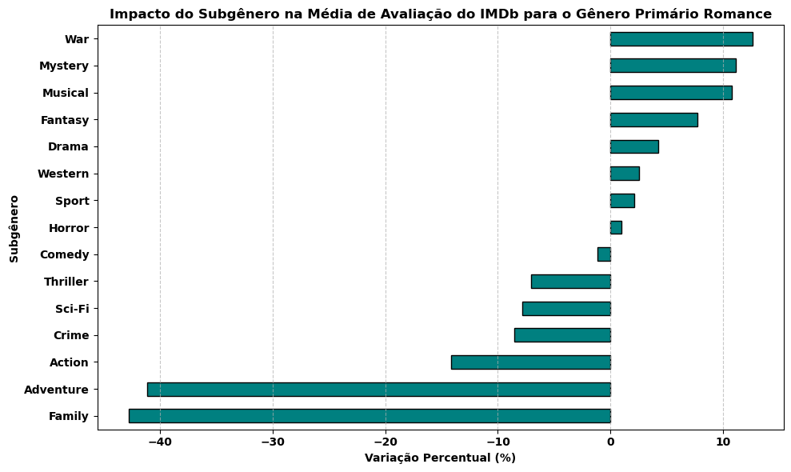

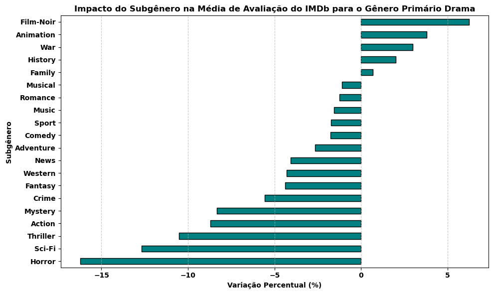

Acima se encontra exemplos de visualizações que foram geradas por meio de uma função personalizada, o intuito é fornecer uma ferramenta onde é possível observar quais subgenêros tem o maior poder de impactar a nota de um filme de determinado gênero primário.

**Ferramenta de Decisão para Cineastas**: O script é extremamente útil para cineastas que desejam entender o impacto de combinar diferentes subgêneros com um gênero primário. Ao visualizar a variação percentual, os cineastas podem tomar decisões informadas sobre quais subgêneros introduzir em um filme para potencialmente aumentar sua popularidade e avaliação.

**Evitando Combinações Desfavoráveis**: Da mesma forma, ao identificar subgêneros que podem diminuir a avaliação média, os cineastas podem optar por evitar certas combinações ou abordar a narrativa de uma maneira que neutralize possíveis rejeições.

**Flexibilidade e Customização**: O script oferece flexibilidade, pois permite que os usuários escolham qualquer gênero primário e visualizem o impacto dos subgêneros. Isso é valioso porque os cineastas podem adaptar sua abordagem com base no gênero específico de filme que estão produzindo.

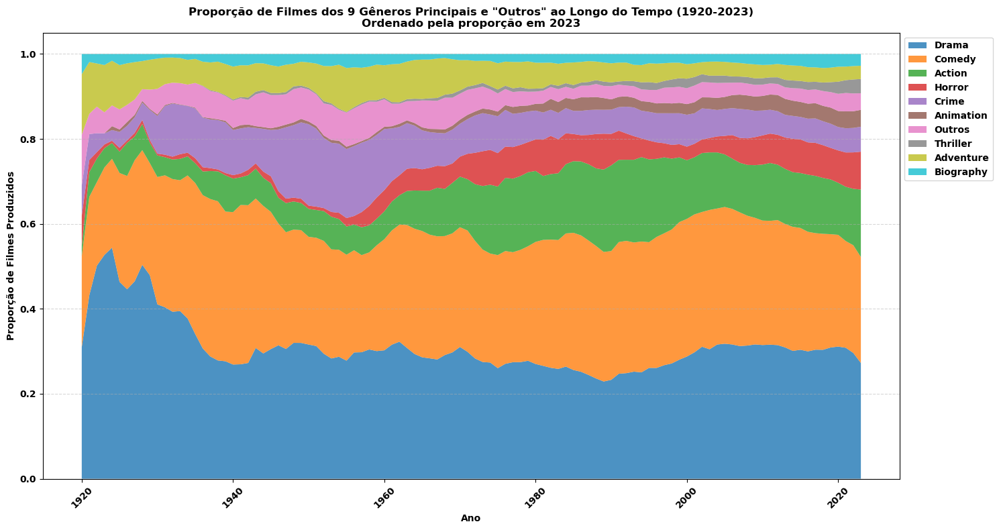
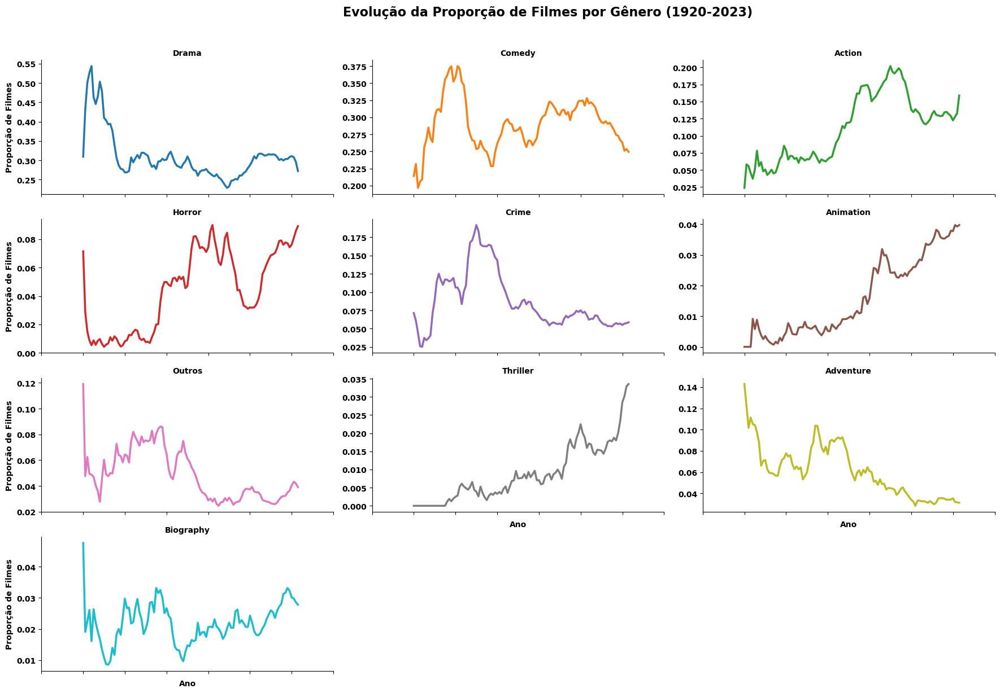
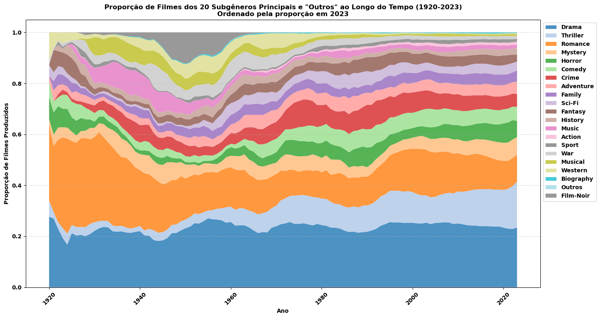
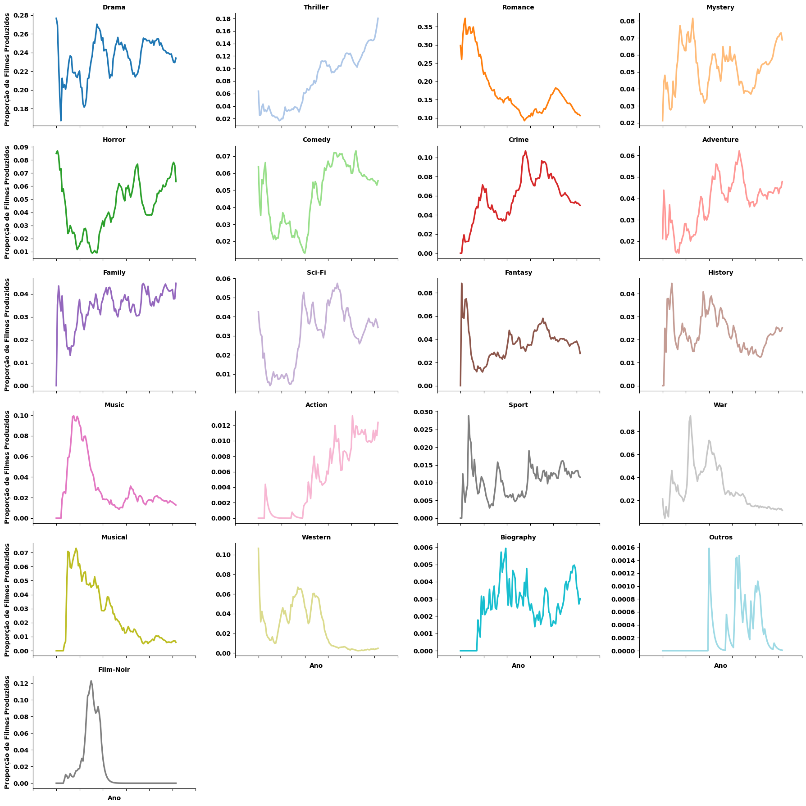

As visualizações acima tratam da proporção de filmes com determinados gêneros e subgêneros lançados por ano. O intuito é fornecer informações a respeito da popularidade de certos gêneros, assim como explorar possíveis tendências.

**Prevalência de Drama**: A análise mostra que o gênero Drama mantém uma presença dominante ao longo dos anos, tanto como gênero primário quanto subgênero. Esta observação indica uma preferência contínua por narrativas dramáticas, talvez devido à sua capacidade universal de ressonância com experiências humanas mais profundas.

**Evolução dos Gêneros Primários**: Há um aumento notável na produção de filmes de "Animação", que pode ser correlacionado com avanços tecnológicos e a alta aceitação do público para esse gênero. Gêneros como "Ação" e "Thriller" também mostram um crescimento, o que pode ser interpretado como uma preferência por tramas mais intensas e dinâmicas.

**Evolução dos Subgêneros**: O subgênero "Thriller" apresenta um crescimento expressivo, passando de 4% para 18% em proporção nos últimos 100 anos. Isso pode refletir um interesse crescente por tramas complexas e tensas. Já o subgênero "Mistério" mostra uma curva em forma de "U", sugerindo uma ressurgência após um período de declínio, possivelmente devido a um renovado interesse em enigmas e mistérios. Vale ressaltar que os dois subgêneros se complementam muito bem, o que comprova que essa popularidade observada é verdadeira.

**Tendências de baixa**: Alguns gêneros primários, como "Aventura" e "Crime", demonstram uma queda na sua proporção ao longo dos anos. Isso pode ser um indicativo de saturação da indústria ou mudanças nas preferências do público. Entre os subgêneros, "Romance", "Music", "Musical" e "Guerra" mostram uma tendência de baixa, possivelmente refletindo uma procura por narrativas mais contemporâneas e menos idealizadas.

**Planejamento de Produção**: Essas observações são valiosas para produtores e estúdios na tomada de decisões estratégicas. A análise das tendências pode orientar investimentos em gêneros em ascensão ou na exploração de nichos menos saturados, oferecendo oportunidades para inovação e diferenciação.

**Decisões de Roteiro**: Para roteiristas, entender as tendências de gênero é fundamental. A popularidade crescente de gêneros como "Thriller" e "Mistério" pode incentivá-los a desenvolver histórias que se alinhem com essas preferências, ao mesmo tempo em que exploram novas formas de revitalizar gêneros em declínio.

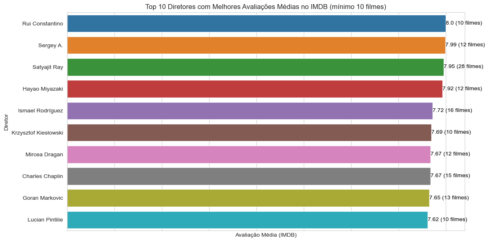

| Diretor             | Gênero Primário | Porcentagem (%) |
|---------------------|-----------------|-----------------|
| Rui Constantino     | Action          | 100.0           |
| Sergey A.           | Horror          | 50.0            |
|                     | Action          | 16.67           |
|                     | Fantasy         | 8.33            |
|                     | Drama           | 8.33            |
|                     | Adventure       | 8.33            |
|                     | Sci-Fi          | 8.33            |
| Satyajit Ray        | Drama           | 67.86           |
|                     | Comedy          | 17.86           |
|                     | Adventure       | 10.71           |
|                     | Crime           | 3.57            |
| Hayao Miyazaki      | Animation       | 100.0           |
| Ismael Rodríguez    | Comedy          | 50.0            |
|                     | Drama           | 43.75           |
|                     | Adventure       | 6.25            |
| Krzysztof Kieslowski| Drama           | 70.0            |
|                     | Comedy          | 20.0            |
|                     | Crime           | 10.0            |
| Mircea Dragan       | Action          | 41.67           |
|                     | Comedy          | 25.0            |
|                     | Adventure       | 16.67           |
|                     | Drama           | 8.33            |
|                     | Biography       | 8.33            |
| Charles Chaplin     | Comedy          | 80.0            |
|                     | Drama           | 13.33           |
|                     | Adventure       | 6.67            |
| Goran Markovic      | Comedy          | 61.54           |
|                     | Drama           | 23.08           |
|                     | Action          | 15.38           |
| Lucian Pintilie     | Drama           | 50.0            |
|                     | Comedy          | 30.0            |
|                     | Crime           | 10.0            |
|                     | Biography       | 10.0            |

**Influência do Gênero nas Avaliações**: Embora certos gêneros possam ter uma média de avaliação geralmente mais baixa ou mais alta, os top diretores demonstram que a qualidade da direção pode superar as expectativas do gênero. Por exemplo, Sergey A. se destaca com filmes de terror altamente avaliados, apesar do gênero ser conhecido por ter uma média de avaliação menor. Isso sugere que a habilidade e o talento do diretor podem elevar a percepção e a recepção de gêneros geralmente menos valorizados.

**Especialização de Gênero**: Muitos dos top diretores mostram uma clara especialização em certos gêneros. Hayao Miyazaki é renomado por seus filmes de animação, enquanto Charles Chaplin é inconfundível no gênero comédia. Essa especialização indica uma afinidade e maestria em contar histórias dentro de um espectro particular, o que pode ser um fator-chave em suas altas avaliações.

**Diversidade de Portfólios**: Enquanto alguns diretores se destacam em gêneros específicos, outros, como Satyajit Ray e Ismael Rodríguez, mostram uma diversidade impressionante em seus portfólios. Isso reflete uma versatilidade na direção e a capacidade de contar histórias em vários contextos e estilos, o que pode ser atraente para um público mais amplo e contribuir para uma maior média de avaliação.

**Inspiração e Aprendizado**: Os top diretores servem como fonte de inspiração para cineastas emergentes e estabelecidos. Estudar suas filmografias, abordagens narrativas e técnicas de direção pode oferecer insights valiosos sobre o que torna seus filmes bem-sucedidos. Por exemplo, a forma como Hayao Miyazaki infunde elementos culturais japoneses em suas animações ou a habilidade de Krzysztof Kieslowski em tecer elementos de romance e drama podem servir de inspiração para diretores que buscam aprimorar sua própria arte.

**Reconhecimento além da Fama**: Os dados revelam que a fama e o reconhecimento de um diretor não são sempre sinônimos de avaliações altas. Diretores como Rui Constantino, que podem não ser amplamente conhecidos pelo público mainstream, ainda assim alcançam altas avaliações, demonstrando que a qualidade do trabalho pode se destacar independentemente da fama. Isso destaca a importância de olhar além dos nomes mais reconhecidos da indústria e valorizar o talento onde quer que ele seja encontrado.

**Planejamento de Produção e Descoberta de Talentos:** A análise das especializações dos diretores oferece insights valiosos para a indústria cinematográfica. Apostar em diretores com êxito comprovado em gêneros específicos pode capturar tendências de mercado e atender às preferências do público. Paralelamente, o reconhecimento de diretores menos conhecidos, como Rui Constantino, pode revelar talentos subaproveitados. Muitos desses diretores, apesar de talentosos, enfrentam limitações orçamentárias que restringem seu potencial criativo. Investir nesses cineastas não só pode ser uma estratégia lucrativa, mas também pode trazer narrativas inéditas e inovadoras para o primeiro plano, diversificando e enriquecendo o cenário cinematográfico.

## Conclusões e Recomendações💡

Este projeto conseguiu alcançar seus objetivos com sucesso, oferecendo insights valiosos sobre a indústria cinematográfica. As principais descobertas foram:

- **Análise Detalhada de Gêneros:** As tendências de popularidade dos gêneros primários e subgêneros foram reveladas, fornecendo informações estratégicas para a tomada de decisões na indústria cinematográfica. Além disso, o estudo desvendou como certas combinações de gêneros podem influenciar positivamente a recepção do público e a performance de bilheteria, oferecendo insights valiosos para a concepção e marketing de novas produções.

- **Influência das Variáveis Numéricas:** Identificamos que variáveis como duração e número de votos possuem uma correlação, ainda que fraca, com as avaliações dos filmes. Isso sinaliza que aspectos não mensurados neste estudo podem ter influência significativa e merecem uma investigação mais aprofundada.

- **Diretores e Avaliações de Filmes:** Ficou evidente que a habilidade de um diretor transcende os gêneros, podendo ser um fator crucial nas avaliações de filmes. Além disso, o destaque dado a diretores menos conhecidos abre caminho para investimentos estratégicos e descobertas de novos talentos na indústria.

Com base nessas descobertas, recomendamos:

- **Enriquecimento de Dados:** A expansão do conjunto de dados para incluir variáveis adicionais, como orçamento, receitas, premiações e elenco, pode oferecer uma visão mais completa e refinada dos fatores que influenciam o sucesso de um filme.

- **Modelagem Preditiva:** A construção de modelos preditivos usando técnicas de machine learning pode antecipar o potencial de sucesso de um filme, tornando-se uma ferramenta inestimável para produtores e distribuidores.

- **Feedback da Indústria:** É essencial buscar a validação dos resultados por meio de feedback direto dos profissionais da indústria, alinhando as descobertas do projeto com as realidades práticas do mercado cinematográfico.

## Considerações Finais📝

O conjunto de dados analisado demonstrou ser uma fonte rica de insights, permitindo uma compreensão mais profunda das dinâmicas da indústria cinematográfica. As descobertas têm o potencial não apenas de informar, mas também de influenciar as estratégias e decisões dos profissionais do campo. Conclui-se que, enquanto o projeto alcançou seu objetivo inicial, ele também forneceu o caminho para investigações futuras, prometendo contribuições ainda mais significativas para o mundo do cinema.

## Licença©️

Este projeto está licenciado sob a [Creative Commons Attribution-NonCommercial 4.0 International License (CC BY-NC 4.0)](https://creativecommons.org/licenses/by-nc/4.0/). Use e compartilhe de forma responsável.

## Créditos👏

Este projeto utiliza dados fornecidos pela [OMDb API](https://www.omdbapi.com/), que estão licenciados sob a [Creative Commons Attribution-NonCommercial 4.0 International License](https://creativecommons.org/licenses/by-nc/4.0/). Os dados foram utilizados para fins educacionais e não comerciais neste projeto. Para fins de análise, foram realizadas transformações e limpezas nos dados, mas sem alterar seu conteúdo original de maneira substancial.

## Disclaimer⚠️

Este projeto foi desenvolvido exclusivamente para fins educacionais e de demonstração das habilidades analíticas e de manipulação de dados do autor, sem quaisquer objetivos comerciais ou de lucro. Todos os dados utilizados são de domínio público ou foram adquiridos e utilizados em conformidade com as diretrizes e termos de uso das respectivas fontes de dados.

As técnicas de coleta de dados e análise aplicadas neste projeto refletem as habilidades do autor e não têm a intenção de violar quaisquer diretrizes de direitos autorais ou leis aplicáveis. O autor não se responsabiliza por interpretações ou conclusões de terceiros baseadas nas análises apresentadas. O uso das informações fornecidas neste projeto é de responsabilidade exclusiva do usuário. É crucial que qualquer uso dos métodos ou dados apresentados aqui seja feito com cautela e em conformidade estrita com as leis e regulamentos aplicáveis.